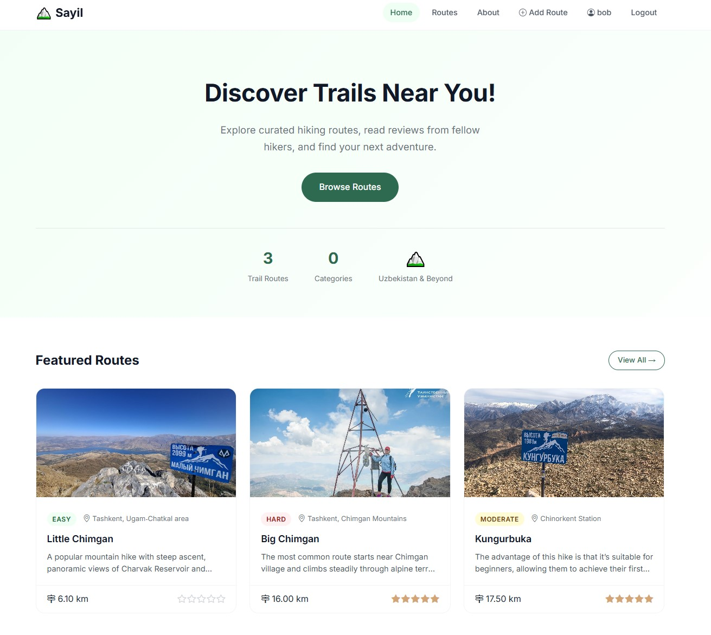

# Sayil 🏔️

A hiking route discovery platform for Uzbekistan. Browse trails, post reviews, and share your favourite routes.



**Live site:** https://sayil.uz

---

## Table of Contents

- [Features](#features)
- [Tech Stack](#tech-stack)
- [Project Structure](#project-structure)
- [Local Development](#local-development)
- [Environment Variables](#environment-variables)
- [Running Tests](#running-tests)
- [Production Deployment](#production-deployment)
- [CI/CD Pipeline](#cicd-pipeline)

---

## Features

- Browse and filter hiking routes by difficulty, distance, and category
- Submit routes with cover photo, elevation gain, estimated duration, and location
- 1–5 star reviews with comments; one review per user per route enforced
- Toggle routes as favourites; view all favourites from your profile page
- Staff-only route create / edit / delete; auto-slug generation with collision handling
- User registration and login; profile with avatar and bio
- `UserProfile` auto-created via Django `post_save` signal on every new `User`

---

## Tech Stack

| Layer | Technology |
|---|---|
| Backend | Django 6.0.2, Python 3.12 |
| WSGI server | Gunicorn 25.1.0 |
| Reverse proxy | Nginx (Alpine) |
| Database | PostgreSQL 16 |
| Forms / styling | django-crispy-forms, Bootstrap 5 |
| Containerisation | Docker, Docker Compose |
| CI/CD | GitHub Actions |
| TLS | Let's Encrypt via Certbot |

---

## Project Structure

```
sayil/                  # Django project package (settings, root urls, wsgi)
accounts/               # Authentication app
  models.py             #   UserProfile (OneToOneField extension of User)
  views.py              #   register, login, profile, profile_edit
  forms.py              #   RegisterForm, UserUpdateForm, UserProfileForm
  signals.py            #   auto-creates UserProfile on User post_save
  urls.py
  templates/accounts/
routes/                 # Core domain app
  models.py             #   Category, Route, Review
  views.py              #   home, list, detail, create, edit, delete,
  #                         add_review, toggle_favorite, about
  forms.py              #   RouteForm, ReviewForm
  urls.py
  templates/routes/
templates/              # Shared base.html, home.html, about.html
static/                 # CSS, JS
tests/                  # pytest test suite (5 test functions)
nginx/                  # nginx.conf
Dockerfile
docker-compose.yml      # Production stack
docker-compose.dev.yml  # Local development stack
gunicorn.conf.py        # Gunicorn worker configuration
entrypoint.sh           # Container startup script
.github/workflows/
  deploy.yml            # CI/CD pipeline (test → build → deploy)
.env.example            # Environment variable reference
```

---

## Local Development

### Prerequisites

- Docker and Docker Compose v2

### Steps

```bash
# 1. Clone the repository
git clone https://github.com/wiutbob/sayil.git
cd sayil

# 2. Create your local .env from the example
cp .env.example .env
# Edit .env and set at least SECRET_KEY and DB_PASSWORD

# 3. Start the development stack (builds locally, exposes port 8000 and 5432)
docker compose -f docker-compose.dev.yml up --build

# 4. Open the app
# http://localhost:8000

# 5. (Optional) Seed the database with sample data
docker compose -f docker-compose.dev.yml exec web python seed.py
```

The dev compose file mounts the project directory into the container, so code changes reflect immediately without rebuilding.

---

## Environment Variables

Copy `.env.example` to `.env` and fill in the values. Never commit `.env`.

| Variable | Description | Example |
|---|---|---|
| `SECRET_KEY` | Django secret key | `change-me-in-production` |
| `DEBUG` | Enable debug mode | `True` (dev) / `False` (prod) |
| `ALLOWED_HOSTS` | Comma-separated allowed hosts | `localhost,127.0.0.1` |
| `CSRF_TRUSTED_ORIGINS` | Comma-separated trusted origins | `https://sayil.uz` |
| `DB_NAME` | PostgreSQL database name | `sayil_db` |
| `DB_USER` | PostgreSQL username | `sayil_user` |
| `DB_PASSWORD` | PostgreSQL password | `a-strong-password` |
| `DB_HOST` | Database host | `db` (service name in Compose) |
| `DB_PORT` | Database port | `5432` |

---

## Running Tests

```bash
# Run the full test suite
pytest

# With verbose output
pytest -v

# Linting (fatal errors only)
flake8 . --count --select=E9,F63,F7,F82 --show-source --statistics

# Linting (full style check, non-blocking)
flake8 . --count --exit-zero --max-line-length=127 --statistics
```

The test suite covers:

- `test_home_page` — home page returns HTTP 200
- `test_routes_list_page` — route list page returns HTTP 200
- `test_login_page_renders` — login page renders correctly
- `test_create_category_and_route` — model creation, slug generation, review average
- `test_review_creation_and_average` — review averaging logic
- `test_user_profile_creation_signal` — `UserProfile` auto-created via signal

---

## Production Deployment

The production stack uses the pre-built Docker Hub image. You do not need the source code on the server to run it.

### First-time setup on a fresh Hostman VPS (Ubuntu 20.04)

```bash
# 1. Create a non-root sudo user and log in as that user
# 2. Disable root SSH login in /etc/ssh/sshd_config and restart sshd

# 3. Configure firewall
sudo ufw allow 22
sudo ufw allow 80
sudo ufw allow 443
sudo ufw enable

# 4. Install Docker
curl -fsSL https://get.docker.com | sudo sh
sudo usermod -aG docker $USER
# Log out and back in

# 5. Clone the repo (config files only needed)
git clone https://github.com/wiutbob/sayil.git ~/sayil
cd ~/sayil

# 6. Create production .env
cp .env.example .env
# Set SECRET_KEY, DB_PASSWORD, DEBUG=False,
# ALLOWED_HOSTS=sayil.uz,www.sayil.uz,
# CSRF_TRUSTED_ORIGINS=https://sayil.uz,https://www.sayil.uz

# 7. Start the full stack (pulls image from Docker Hub)
docker compose up -d

# 8. Issue TLS certificate (Certbot runs once automatically)
# Verify the site is live at https://sayil.uz
```

### Subsequent deployments

Subsequent deployments are handled automatically by the CI/CD pipeline on every push to `main`. To trigger a manual redeploy:

```bash
cd ~/sayil
git pull origin main
docker pull wiutbob/sayil-web:latest
docker compose up -d --no-deps --force-recreate web
```

---

## CI/CD Pipeline

The GitHub Actions workflow (`.github/workflows/deploy.yml`) runs on every push and pull request to `main`.

### Jobs

| Job | Trigger | What it does |
|---|---|---|
| **test** | push + PR | PostgreSQL service container, flake8 lint, pytest |
| **build-and-push** | push to `main` only | Multi-stage Docker build with GHA layer cache; pushes `:latest` and `:<git-sha>` to Docker Hub |
| **deploy** | push to `main` only | SSH into VPS, pull new image, recreate `web` only, health-check, Nginx reload, image prune |

### Required GitHub Secrets

| Secret | Description |
|---|---|
| `DOCKERHUB_USERNAME` | Docker Hub username |
| `DOCKERHUB_TOKEN` | Docker Hub access token |
| `SSH_HOST` | VPS IP address or hostname |
| `SSH_USERNAME` | SSH user on the VPS |
| `SSH_PRIVATE_KEY` | Private key for SSH authentication |

---
